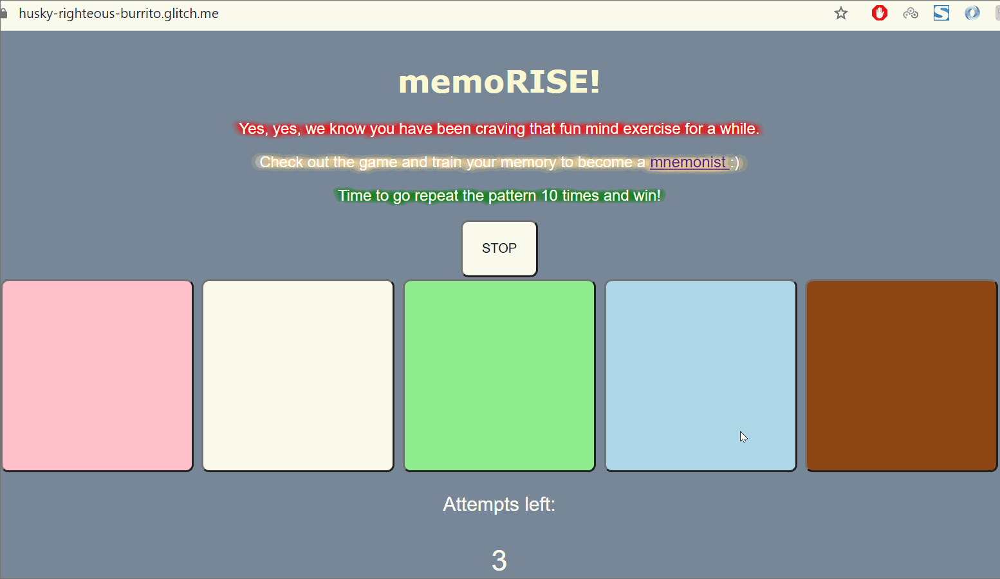

**memoRISE** is a light and sound memory game. 

The following functionality is complete:

* [x] Game interface has a heading (h1 tag), a line of body text (p tag), and four buttons that match the demo app
* [x] "Start" button toggles between "Start" and "Stop" when clicked. 
* [x] Game buttons each light up and play a sound when clicked. 
* [x] Computer plays back sequence of clues including sound and visual cue for each button
* [x] Play progresses to the next turn (the user gets the next step in the pattern) after a correct guess. 
* [x] User wins the game after guessing a complete pattern
* [x] User loses the game after an incorrect guess
* [x] Buttons use a pitch (frequency) other than the ones in the tutorial
* [x] More than 4 functional game buttons
* [x] Playback speeds up on each turn
* [x] Computer picks a different pattern each time the game is played
* [x] Player only loses after 3 mistakes (instead of on the first mistake)

## Video Walkthrough

Here's a walkthrough of implemented user stories:

 

There are multiple ways to improve the existing project:

* We can define a "pause" button that can pause the game at any moment without players losing their progress. This might be helpful for specific market segments (e.g., kids that need to write down the colors in the correct order of appearance on the screen). The feature might also help users who would like to improve their spaced practice skills. They can do so by looking at the sequence of colors and then returning to the game in 5-10 minutes and checking if they still remember the sequence. 

* Playing chords from famous songs (e.g., chorus part) is another suggestion on how to improve the product. This will keep the players engaged with the game even if they have already won it once. In this case,  the main challenge is to create a database of songs on the backend, randomly choose a song before the game start and play some part of it (e.g., 5 seconds) for every pressed button. As a result, the users  should hear 50 seconds of the song if they reach the final round of the game, given that there are 10 elements in the pattern. 

* Representing attempts visually is one more way to improve the game UI. For instance, we can define each attempt as a cross in the upper right corner of the webpage. If a user makes a mistake, one cross should disappear. Additionally, we can add a specific error sound to the algorithm so that users hear it when they have chosen the wrong button. 

## License

    Copyright [Vladyslav Petrenko]

    Licensed under the Apache License, Version 2.0 (the "License");
    you may not use this file except in compliance with the License.
    You may obtain a copy of the License at

        http://www.apache.org/licenses/LICENSE-2.0

    Unless required by applicable law or agreed to in writing, software
    distributed under the License is distributed on an "AS IS" BASIS,
    WITHOUT WARRANTIES OR CONDITIONS OF ANY KIND, either express or implied.
    See the License for the specific language governing permissions and
    limitations under the License.
